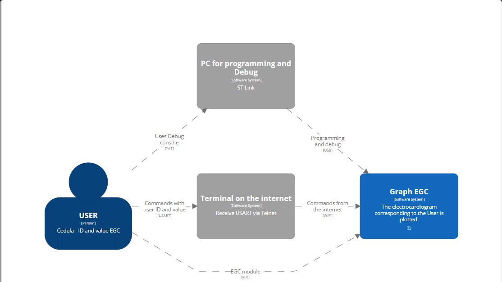
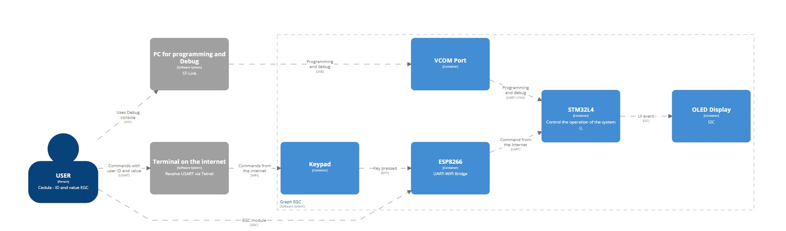
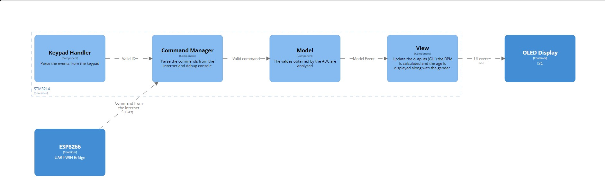

# C4Model
Use the [structurizr-dsl](https://www.structurizr.com/dsl) online tool to render the diagrams with the code in [C4Model.dsl](C4Model.dsl)

## Context Diagram
The user can prompt the digital lock system either by using:
1. The debug terminal from a host PC through the ST-Link COM port.
2. The hex keypad for ID related transactions.
4. The value of the adc is read
3. The internet over WIFI.

## Container Diagram
The lock system features an STM32L4 as the main processor and an [ESP8266](https://www.espressif.com/en/products/socs/esp8266) as an auxiliar for conenction with the internet (see [ESP-Link](https://github.com/jeelabs/esp-link)). The STM32 controls a hex keypad and adc, and the BPM value and a GUI output on the OLED.

## Component Diagram
The STM32 runs a [controller-model-view](https://en.wikipedia.org/wiki/Model%E2%80%93view%E2%80%93controller) pattern in which the controller captures the events from the keypad as well as the commands from the internet, then the model processes the events and updates the view accordingly.

## Code Diagram
*TODO:* Add the code diagrams here.