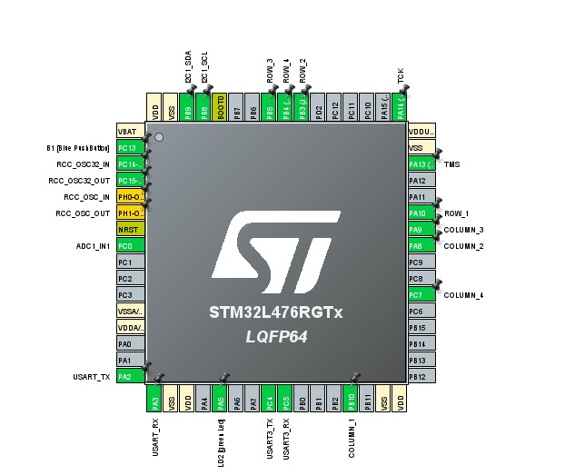

# Electrocardiograma project
This repository contains develop of the final project of the course computation structures.

## Hardware prerequisites
* The project is a heart health monitor featuring an STM32L4 for controling the system, an ESP8266 for interfacing with the internet,a heart rate monitor AD8232 to process data from signal, a keypad to control access, and an OLED display for GUI.

## Firmware prerequisites
* The ESP8266 runs the esp-link [v2.2.3](https://github.com/jeelabs/esp-link/releases/tag/v2.2.3) firmware. Please follow the [serial flashing guide](https://github.com/jeelabs/esp-link/blob/master/FLASHING.md#initial-serial-flashing).
* The STM32 runs the firmware compiled from this repository using STM32CubeIDE.
* A web page is developed using HTML and JavaScript, facilitating the observation of information acquired from sensors. Moreover, it provides the capability to transmit patient data to the Nucleo board via WiFi.
* A Python script is employed to establish communication between the web page and the STM32L4 via Telnet for the purpose of sending or receiving data.

## Building and Flashing
* Open the project in STM32CubeIDE.
* Compile using the current project settings.
* Use an ST-LINK to flash the firmware into the STM32.
* Additionally, the Python script is executed to control the communication between the webpage and the STM32 board.

## Functionality
* The keyboard serves as an access control; the patient's identification document number must be entered. If nothing is entered, the page will not display any information.
* Once the identification document number is entered, it is transmitted via UART to the ESP8266. This data is received through Telnet in Python. Subsequently, the information is graphed on the web page through a WebSocket.
* The page displays the graph based on information obtained from the sensor and also allows sending information to the ESP8266 via Telnet. The ESP8266, in turn, transmits the received information through UART to the main program for processing.
* Using machine logic instead of state delays, data is displayed sequentially on the screen every 3 seconds. This includes information such as gender, age, beats per minute (bpm), and an image depending on the patient's cardiac health status based on age and bpm ranges according to gender.

## Youtube video showing how the project works
* link: https://youtu.be/K5PrwkUpdh0?si=EdRIUmZuNysao4jQ 